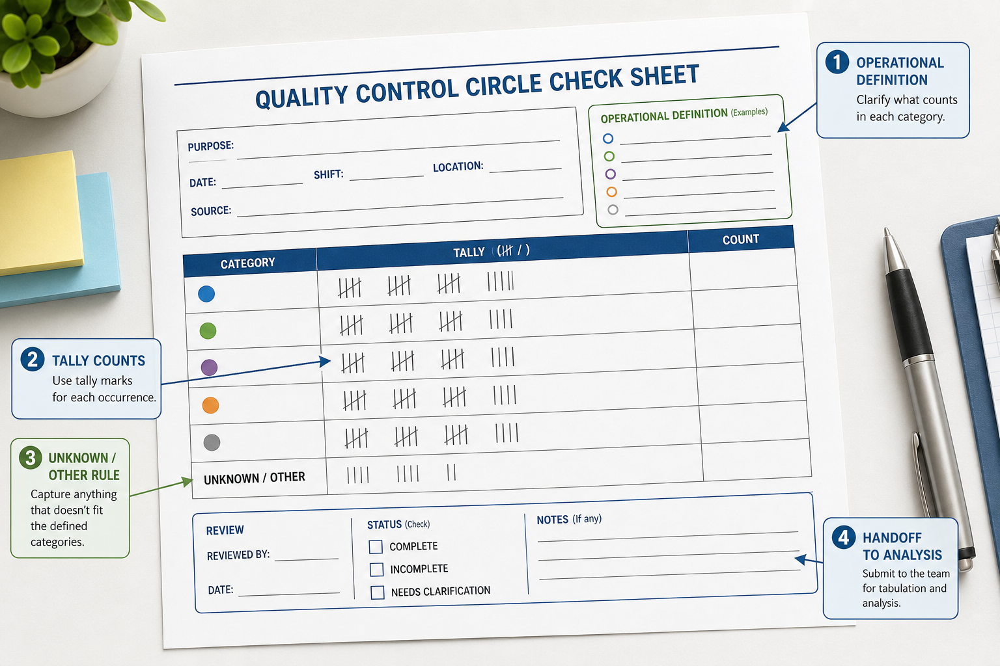

# Check Sheet

Method ID: check-sheet
Method name: Check Sheet
Method type: worksheet
QCC stages: Problem selection / Understand Current Condition / Verification
Status: draft
Guide version: 0.1.0
Image policy: reviewed conceptual worksheet visual available
Automation policy: tool-neutral manual worksheet guidance first
Source: `docs/methods-key-content.md`

## Summary

A Check Sheet is a structured observation worksheet for collecting facts consistently before analysis.
It is not a generic checklist for remembering tasks.
It defines what to observe, where and when to observe it, how to classify each observation, and how to preserve review context.

The output is Structured observation data.
It is not a conclusion, not a verified cause, and not proof that an action worked.

## QCC stage fit

Use Check Sheet during Problem selection when the team needs first facts before choosing a project theme.
Use it during Understand Current Condition when the team needs repeatable counts by category, location, shift, time period, product, or process context.
Use it during Verification when before/after counting needs the same observation rules and scope.

The handoff is usually to stratification, Pareto Chart, Histogram, or another analysis method.
Do not use the worksheet as a substitute for cause analysis.

## What question this method answers

What is happening, how often is it observed, and under what defined scope was it counted?

## When to use

Use a Check Sheet when observations can be collected at the worksite or from records using stable definitions.
It fits when the team needs simple, repeatable counts by category, location, shift, time period, product, process step, or other agreed stratification.
It also fits when a later Pareto Chart, Histogram, or stratification view needs trustworthy source observations.

## When not to use

Do not use a Check Sheet when the observation purpose is unclear.
Do not use it when collectors cannot apply the same operational definitions.
Do not use it when categories are likely to change mid-collection without a documented restart or revision.
Do not treat a tally pattern as root-cause proof.

## Required inputs

- Clear observation purpose.
- Operational definitions for what counts as one observation.
- Observation period and scope.
- Location, shift, product, or process context where relevant.
- Mutually understandable categories.
- Rules for blank, unknown, and other observations.
- Sampling or coverage guidance.
- Collector or owner.
- Source record or worksite observation basis.
- Short pilot plan before full collection.

## Output

The output is a completed observation worksheet with structured observation data.
It should show the observation definition, categories, tallies or counts, collection period, scope, source, collector, known exclusions, review status, and next analysis handoff.

The output does not identify root cause by itself.
It makes later analysis more reliable by preserving how the facts were collected.

## Manual chart or diagram recipe

This method produces a worksheet rather than a chart or diagram.
Create the worksheet manually with rows for categories or observation items and columns for the agreed collection units, such as date, time block, shift, location, product, or process step.
Leave space for source, collection rules, blank/unknown/other rules, exclusions, collector, reviewer, and next action.

## Worksheet purpose

The worksheet turns vague observations into repeatable counts.
It helps the team collect baseline facts before selecting a focus, building a Pareto Chart, reviewing numeric spread with a Histogram, or checking whether a change affected the counted result.

## Required data structure

Each observation should be classified using one agreed definition.
Each tally should belong to one collection scope and one observation period.
When categories are used, they should be mutually understandable and stable during collection.

Use "blank" only when no value was recorded.
Use "unknown" when the team can observe that a value exists but cannot classify it.
Use "other" only with a note that can be reviewed later.

## Data preparation

Define categories before collection starts.
Run a short pilot to check whether collectors interpret the observation definition and categories the same way.
Revise confusing categories before full collection rather than silently correcting them afterward.

If the pilot reveals unclear definitions, update the worksheet and restart the collection period.
Do not merge periods collected under different rules unless the evidence note explains the change and its limits.

## Tool-selection guidance

Use any suitable worksheet, form, presentation, or data-entry tool when the source, period, definitions, and review fields remain visible.
The tool is secondary to consistent observation rules and evidence traceability.

## Worksheet construction steps

1. State the clear observation purpose.
2. Define what counts as one observation.
3. Define the observation period and scope.
4. Add location, shift, product, or process context fields where relevant.
5. Define mutually understandable categories before collection starts.
6. Add rules for blank, unknown, and other observations.
7. Add sampling or coverage guidance.
8. Pilot the sheet with a small number of observations.
9. Revise unclear definitions before full collection.
10. Collect tallies during the agreed period.
11. Review totals, category use, and collection problems before handoff.
12. Hand off validated observations to stratification, Pareto Chart, Histogram, or another analysis method.

## Formatting standard

Use a title that names the observation purpose, period, and scope.
Keep category labels readable and stable.
Keep source, collector, review status, and collection rules visible.
Separate tally fields from interpretation and next action fields.

## Required annotations

- Observation purpose.
- Operational definitions.
- Observation period and scope.
- Location, shift, product, or process context where relevant.
- Category rules.
- Blank, unknown, and other handling rules.
- Sampling or coverage guidance.
- Source, collector, reviewer, and review date.
- Key limitation and next analysis handoff.

## Interpretation limits

Safe interpretation says what was observed and how often under the stated scope.
Unsafe interpretation claims that the most frequent tally is the root cause or that the worksheet verifies a countermeasure by itself.

The Check Sheet can show occurrence patterns.
It cannot prove why the pattern happened.
Use later evidence checks before selecting countermeasures or claiming improvement.

## Common mistakes

- Treating the sheet as a generic checklist rather than an observation worksheet.
- Changing categories during collection without restarting or documenting the change.
- Leaving "other" notes ambiguous.
- Mixing different collection periods, scopes, products, shifts, or locations.
- Omitting the observation definition, source, date range, or collection rules.
- Treating tallies as root-cause proof.
- Hiding uncertain blank or unknown observations.

## Quality standards

The worksheet is acceptable when a reviewer can see what was counted, how categories were defined, who collected the observations, when and where collection occurred, what exclusions or unknowns exist, and what analysis method receives the handoff.

The worksheet is weak when it only lists checkmarks without operational definitions, period, scope, source, or review status.

## Evidence note

For project use, preserve source, date range, collection rules, filters, scope, collector, reviewer, assumptions, exclusions, and review status.
If the worksheet feeds a chart, keep the worksheet or source table with the final chart evidence.
If a pilot changed the collection rules, record what changed and whether earlier observations were excluded.

Evidence level:

- Teaching or draft use can use a small synthetic example.
- Normal QCC project use should preserve the completed worksheet and review checklist.
- Formal review should preserve the source worksheet, summarized table, category definitions, and reviewer status.

## Review checklist

| Check | Pass | Fail | Notes |
|---|---|---|---|
| observation purpose is clear |  |  |  |
| operational definitions state what counts as one observation |  |  |  |
| observation period and scope are stated |  |  |  |
| relevant location, shift, product, or process context is visible |  |  |  |
| categories are mutually understandable |  |  |  |
| blank, unknown, and other observations have rules |  |  |  |
| sampling or coverage guidance is stated |  |  |  |
| pilot collection was completed or intentionally skipped with reason |  |  |  |
| source, collector, reviewer, and review status are visible |  |  |  |
| interpretation avoids root-cause and improvement overclaims |  |  |  |
| next analysis handoff is named |  |  |  |

## Image-assisted demonstration notes

Generated visuals are not final evidence.
Use the image only to teach worksheet structure, observation fields, unknown/other handling, review status, and handoff to analysis.
Keep operational definitions, collection rules, sample coverage, source notes, and conclusions in Markdown or the completed project worksheet.

Reviewed teaching visuals:

Prompt record:

- `../docs/media/prompts/check-sheet/check-sheet-worksheet-concept-v0.1.md`

## Related methods

- 5W2H for framing the problem before observation.
- Flowchart / Process Map for deciding where observations should be collected.
- Pareto Chart for ranking counted categories after collection.
- Histogram for numeric observations when the Check Sheet captures measurements rather than simple categories.
- Scatter Diagram when later paired numeric observations need relationship exploration.
