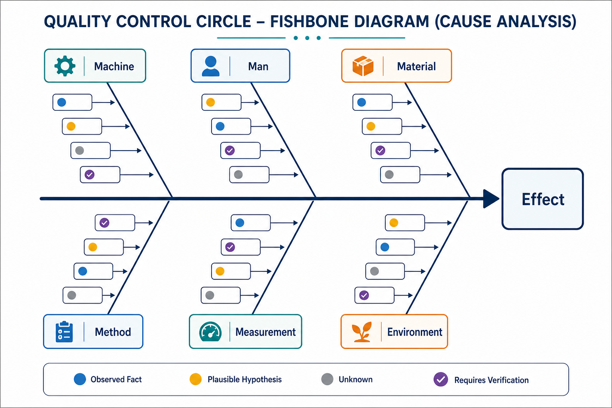

# Fishbone Diagram

Method ID: fishbone-diagram
Method name: Fishbone Diagram
Method type: diagram
QCC stages: Analyze Causes
Status: draft
Guide version: 0.1.0
Image policy: reviewed conceptual fishbone visual available
Automation policy: tool-neutral manual guidance first
Source: `docs/methods-key-content.md`

## Summary

A Fishbone Diagram organizes possible causes for one clearly stated effect.
It helps a QCC team make cause hypotheses visible before selecting what to check.

The output is a structured set of cause hypotheses.
It is not verified root cause and should not be used as proof that a cause is true.

## QCC stage fit

Use Fishbone Diagram during Analyze Causes after the team has a defined effect from current-state evidence.
The effect may come from a Check Sheet, Pareto Chart, Histogram, process map, complaint review, or other observed project evidence.

The normal handoff is to evidence checks, selected 5 Whys chains, stratification, direct observation, or another verification activity.
Do not use the diagram as a substitute for verification.

## What question this method answers

What possible causes could explain this one effect, and which hypotheses should be checked first?

## When to use

Use a Fishbone Diagram when the team needs to organize suspected causes before choosing verification work.
It fits when one effect statement can be written precisely and the team can separate observed facts from proposed causes.
It is useful when several cause categories may contribute and the team needs prioritization for further checking.

## When not to use

Do not use a Fishbone Diagram when the effect statement is vague or combines several different problems.
Do not use it when the team wants a vote or brainstorm to replace evidence.
Do not force every project into one category model.
Do not mark a cause as verified unless the evidence status and source support that label.

## Required inputs

- One precise effect statement.
- Current-state evidence that explains why the effect matters.
- Context-appropriate categories.
- Observed facts that should anchor the discussion.
- Proposed causes from team knowledge, worksite observation, records, or process review.
- Evidence status labels for each cause.
- Verification or follow-up check plan for selected causes.

## Output

The output is a cause map and shortlist of causes needing evidence or verification.
Each major branch groups related cause hypotheses.
Each selected cause should show whether it is observed, plausible, unknown, rejected, or requires verification.

The output is a structured set of cause hypotheses, not verified root cause.

## Manual chart or diagram recipe

Draw a horizontal arrow pointing to the effect statement.
Place the one precise effect statement at the head of the diagram.
Add major branches for context-appropriate categories.
Add short visible cause statements under the branches.
Keep verification detail, source notes, and long evidence comments in the evidence note or action table.

## Diagram purpose

The diagram turns an unstructured cause discussion into a reviewable structured hypothesis map.
It helps the team see where ideas cluster, where evidence is missing, and which causes deserve deeper checking.

## Category selection

Choose categories that fit the process and project context.
Common patterns such as people, method, machine, material, measurement, and environment can be useful, but there is no mandatory reliance on one category model.
For service, office, education, healthcare, or logistics work, use categories that match the actual process.

## Evidence status notation

Use a simple verification marker for each important cause:

| Status | Meaning |
|---|---|
| observed | Directly seen or supported by current evidence. |
| plausible | Reasonable hypothesis, but evidence is incomplete. |
| unknown | Possible but not yet understood. |
| requires verification | Selected for follow-up checking. |
| rejected | Checked and not supported for this effect. |

Observed facts and proposed causes should be visibly separated.
A proposed cause may be plausible without being observed.

## Diagram construction steps

1. Write one precise effect statement at the head.
2. Confirm the effect matches the project evidence and scope.
3. Select context-appropriate categories.
4. Add short, testable cause statements under each branch.
5. Separate observed facts from proposed causes.
6. Assign evidence status to important causes.
7. Combine duplicate or overlapping causes.
8. Prioritize causes for further checking.
9. Choose follow-up verification, data collection, observation, or 5 Whys chains.
10. Record assumptions, source, session date, facilitator, and next actions.

## Formatting standard

Keep the effect statement specific and readable.
Use branch labels that match the process context.
Use short cause labels on the diagram and move detailed verification notes into a table.
Mark selected causes clearly so the next check is visible.

## Required annotations

- Effect statement.
- Project scope or evidence source.
- Session date and facilitator.
- Category model used and why it fits.
- Evidence status legend.
- Selected causes for follow-up.
- Next verification action, owner, and expected evidence.

## Quality standards

A strong Fishbone Diagram has one effect, process-fit branches, testable cause statements, visible evidence status, and a short list of causes selected for checking.
It does not mix several effects, hide assumptions, or present a brainstorm as verified knowledge.

The diagram should preserve enough context for a reviewer to understand why each selected cause deserves follow-up.

## Interpretation limits

Safe interpretation says which cause hypotheses are organized and which ones need evidence.
Unsafe interpretation claims the diagram has identified root cause before verification.

Use the Fishbone Diagram to choose what to check next.
Use verified evidence before selecting countermeasures or claiming root cause.

## Common mistakes

- Writing several effects at the head.
- Using vague labels instead of testable cause statements.
- Treating symptoms as causes.
- Choosing a category model because it is familiar rather than because it fits the process.
- Mixing observed facts and proposed causes without evidence status.
- Voting on causes without verification.
- Marking causes verified without source evidence.
- Skipping prioritization and leaving every cause equally important.

## Evidence note

For project use, preserve effect statement, source evidence, scope, session date, participants or roles, category model, evidence status legend, selected causes, assumptions, and verification plan.
If a selected cause moves into 5 Whys, keep the diagram reference with the why chain.
If a cause is later rejected, preserve the rejection evidence so the team does not reopen the same unchecked idea.

Evidence level:

- Teaching or draft use can use a small synthetic effect and cause set.
- Normal QCC project use should preserve the diagram and selected-cause table.
- Formal review should preserve source records, verification status, facilitator checklist evidence, and follow-up results.

## Review checklist

| Check | Pass | Fail | Notes |
|---|---|---|---|
| one precise effect statement is shown |  |  |  |
| effect statement matches current-state evidence |  |  |  |
| categories are appropriate to the process context |  |  |  |
| no single category model is treated as mandatory |  |  |  |
| observed facts are separated from proposed causes |  |  |  |
| evidence status is visible for important causes |  |  |  |
| causes selected for further checking are prioritized |  |  |  |
| next verification action is recorded |  |  |  |
| interpretation avoids root-cause overclaiming |  |  |  |

## Image-assisted demonstration notes

Generated visuals are not final evidence.
Use the image only to teach spatial structure, branch categories, cause cards, and evidence-status markers.
Detailed method instructions and evidence status rules should remain in Markdown.
The image does not verify any root cause.

Reviewed teaching visuals:

Prompt record:

- `../docs/media/prompts/fishbone-diagram/fishbone-diagram-concept-v0.1.md`

## Related methods

- Check Sheet for collecting observations before cause analysis.
- Flowchart / Process Map for locating where the effect appears in the process.
- Pareto Chart for selecting the effect or category to analyze.
- 5 Whys for investigating a selected cause chain from the diagram.
- 5W2H for clarifying the problem statement or defining follow-up actions.
