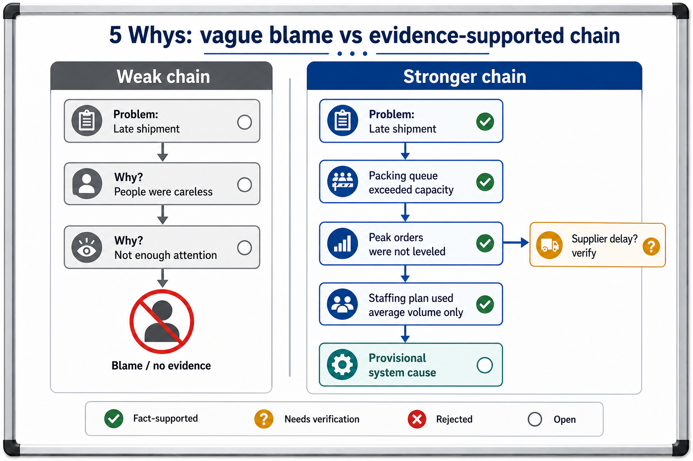

# 5 Whys

Method ID: five-whys
Method name: 5 Whys
Method type: worksheet
QCC stages: Analyze Causes
Status: draft
Guide version: 0.1.0
Image policy: reviewed good-versus-weak chain visual available
Automation policy: tool-neutral manual guidance first
Source: `docs/methods-key-content.md`

## Summary

5 Whys traces a focused problem or suspected cause through linked why answers.
The method is useful when each link can be checked against facts, observation, or verification evidence.

The output is a causal hypothesis chain with verification status.
It is not proof by repetition and remains provisional until checked.

## QCC stage fit

Use 5 Whys during Analyze Causes after the team has selected a focused problem or suspected cause from current-state evidence, a Fishbone Diagram, Pareto review, direct observation, or another analysis step.
It helps the team move from a visible symptom toward an actionable system or process cause supported by evidence.

The handoff is to verification, countermeasure planning, or a return to data collection when the chain is weak.
Do not use 5 Whys as a shortcut around evidence.

## What question this method answers

Why did this focused problem or suspected cause happen, and what system or process cause should be verified before action?

## When to use

Use 5 Whys when the starting point is narrow enough to investigate as one mechanism.
It fits when each answer can be supported by facts, observation, records, or a clear verification status.
It also fits when a Fishbone Diagram identifies a selected cause that needs deeper causal explanation.

## When not to use

Do not use 5 Whys when the starting problem combines several independent mechanisms.
Do not use it when the team is guessing without evidence.
Do not use it to assign personal blame.
Do not stop at a convenient answer that cannot be checked.

## Required inputs

- Focused problem statement or selected suspected cause.
- Evidence source or observation for the starting point.
- Why answers written as checkable statements.
- Evidence for each link, including fact support or verification status for each answer.
- Branching structure when several mechanisms are plausible.
- Stopping condition based on an actionable system or process cause.
- Follow-up verification or countermeasure handoff.

## Output

The output is a causal hypothesis chain with verification status.
It may include branches when several mechanisms are plausible.
Each link should show the answer, evidence or fact support, assumptions, and next check.

The final chain is a candidate explanation, not proof by repetition.

## Manual chart or diagram recipe

Use a worksheet with columns for sequence, question, answer, evidence, verification status, branch ID, and next action.
Start with the focused problem or suspected cause.
Ask why it occurred, record a checkable answer, and repeat only while the next answer is useful and supported.
When the chain branches, keep each branch visible instead of forcing one linear path.

## Worksheet purpose

The worksheet keeps causal reasoning visible.
It shows whether the team is following facts or drifting into assumptions.
It also prevents the fifth answer from being treated as automatically correct.

## Chain rules

Exactly five questions are not required.
One linear chain may be insufficient.
Branches are acceptable when several mechanisms are plausible.

Each answer should be supported by facts or marked with verification status.
Avoid stopping at personal blame.
The stopping point should be an actionable cause, usually an actionable system or process cause supported by evidence.
The final chain remains provisional until checked.

## Evidence status notation

Use a simple status marker for each link:

| Status | Meaning |
|---|---|
| fact-supported | Evidence or observation supports the link. |
| plausible | The link is reasonable but needs more evidence. |
| unknown | The team cannot yet explain or check the link. |
| requires verification | The link needs a planned check before action. |
| rejected | Evidence does not support the link. |

Do not let an unchecked answer become the basis for a countermeasure.

## Worksheet construction steps

1. State the focused problem or suspected cause.
2. Record the source evidence for the starting point.
3. Ask why it occurred.
4. Write a checkable answer.
5. Add fact support or verification status for that answer.
6. Continue only while the next question produces a meaningful causal link.
7. Branch when more than one mechanism is plausible.
8. Stop at an actionable system or process cause supported by evidence.
9. Define the verification check or countermeasure-planning handoff.
10. Record source, date range, assumptions, facilitator, and reviewer status.

## Formatting standard

Keep each why answer short and testable.
Use branch IDs when the chain splits.
Keep evidence and assumptions visible beside each link.
Do not hide weak or unknown links.

## Required annotations

- Focused problem statement or suspected cause.
- Source evidence for the starting point.
- Why answer for each link.
- Evidence or verification status for each link.
- Branch ID where needed.
- Actionable system or process cause.
- Verification check, owner, expected evidence, and next action.

## Quality standards

A strong 5 Whys worksheet shows a narrow starting point, fact-supported links, visible verification status, and an actionable system or process cause.
It allows branching when the evidence suggests more than one mechanism.
It does not stop at personal blame, convenience, or the fifth answer by default.

## Interpretation limits

Safe interpretation says which causal chain is plausible and what evidence supports or weakens it.
Unsafe interpretation treats repeated "why" questions as proof.

Use the chain to decide what to verify or what system condition to address.
Do not claim root cause until important links are checked.

## Common mistakes

- Starting with a broad problem that contains several mechanisms.
- Treating the fifth answer is not automatically the root cause as a slogan but still stopping there.
- Using opinions as answers.
- Skipping evidence checks.
- Hiding branches to keep the worksheet linear.
- Stopping at a person, department, or training label without a system or process cause.
- Selecting a countermeasure before the chain is checked.

## Evidence note

For project use, preserve source, date range, starting problem, each why answer, evidence checks, assumptions, verification status, branch decisions, facilitator checklist evidence, and next action.
If the chain came from a Fishbone Diagram, keep the selected-cause reference.
If verification rejects a link, update the chain or return to the cause map instead of forcing the old explanation.

Evidence level:

- Teaching or draft use can use a synthetic problem and short chain.
- Normal QCC project use should preserve the worksheet and link evidence.
- Formal review should preserve source records, verification evidence, facilitator checklist evidence, and reviewer status.

## Review checklist

| Check | Pass | Fail | Notes |
|---|---|---|---|
| starting problem or suspected cause is focused |  |  |  |
| source evidence for the starting point is recorded |  |  |  |
| each answer follows from the previous answer |  |  |  |
| each important link has fact support or verification status |  |  |  |
| branches are visible when several mechanisms are plausible |  |  |  |
| the chain avoids stopping at personal blame |  |  |  |
| stopping point is an actionable system or process cause |  |  |  |
| final chain is marked provisional until checked |  |  |  |
| next verification or action-planning handoff is recorded |  |  |  |

## Image-assisted demonstration notes

Generated visuals are not final evidence.
Use the image only to contrast a weak speculative chain with a stronger fact-supported chain that still needs verification.
The worked late-shipment example is synthetic and teaches chain quality, not a real project conclusion.
Detailed chain rules and verification status should remain in Markdown.
The image does not prove root cause and does not require exactly five questions.

Reviewed teaching visuals:

Prompt record:

- `../docs/media/prompts/five-whys/five-whys-good-vs-weak-chain-v0.1.md`

## Related methods

- Fishbone Diagram for organizing possible causes before selecting a chain.
- Check Sheet for collecting observations that can support or reject why links.
- Flowchart / Process Map for understanding the process where the mechanism occurs.
- Pareto Chart for selecting a focused problem category before cause analysis.
- 5W2H for turning verified causes into clear actions during countermeasure planning.
