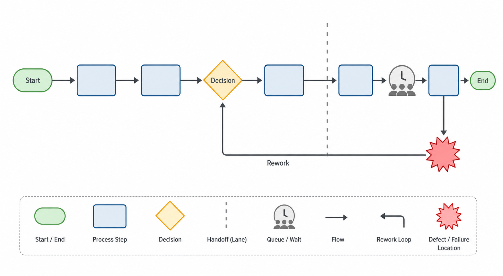
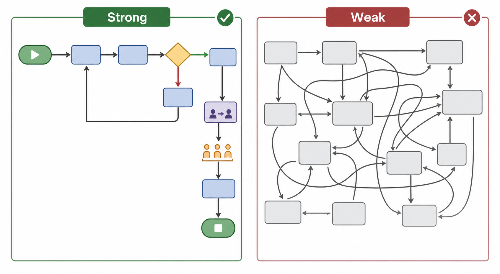

# Flowchart / Process Map

Status: draft
Guide version: 0.1.0
Method ID: flowchart
Method name: Flowchart / Process Map
Method type: diagram
QCC stages: understand current condition; analyze causes; plan verification
Evidence risk: medium
Image policy: conceptual teaching images only
Automation policy: manual diagram creation first; no required named tool

## Summary

A Flowchart / Process Map shows how work actually moves through a process.
It makes steps, decisions, handoffs, queues, rework loops, and failure locations visible before a team starts cause analysis.
This guide teaches current-state process understanding, not generic diagramming.

## QCC stage fit

Use Flowchart / Process Map during current-state grasp when the team needs to understand the real process before judging causes.
Use it during cause analysis preparation when failures, delays, rework, or handoff problems may explain the observed issue.
Use it during verification planning when the team needs to decide where to observe, measure, or confirm whether a countermeasure changed the process.

## What question this method answers

How does the process actually flow, and where do handoffs, decisions, queues, rework loops, or failures occur?

## When to use

Use Flowchart / Process Map when the team needs a shared current-state view of a process.
It is useful when people describe the process differently, when work crosses teams or roles, when defects appear after handoffs, or when rework and waiting are suspected.
It works best when the map is based on observation, records, interviews with process participants, or a direct walk-through.

## When not to use

Do not use this method as a substitute for measuring the problem.
Do not use it when the team only wants a future-state design without first understanding current state.
Do not treat a polished map as a verified procedure, standard operating procedure, or proof of root cause.
Do not hide disagreement about the process; unresolved disagreement is a signal that the current state needs more observation.

## Required inputs

- Process start boundary.
- Process end boundary.
- Process steps in observed order.
- Decision points and decision outcomes.
- Handoffs between people, roles, teams, machines, systems, or locations.
- Queues, waiting points, batching, or delays.
- Rework loops and repeat steps.
- Failure, defect, delay, or inspection locations.
- Source facts, observation period, participants, or records used to build the map.

## Output

The output is a current-state process diagram with a short evidence note.
The diagram should show start and end points, steps, decisions, handoffs, queues or waiting points, rework loops, and known failure locations.
The output should distinguish observed current state from proposed future state.

## Manual chart or diagram recipe

Create the process map manually with a suitable diagramming, presentation, whiteboard, or worksheet tool class.
Keep the map simple enough that the process sequence and handoffs are readable.
Preserve the source facts and review notes with the map.

## Chart purpose

This diagram answers how the work flows before deeper cause analysis.
Its purpose is shared understanding, not final evidence by itself.

## Required data structure

Use process facts rather than numeric chart data.
Each process element should have a label, a type, and a source.
Useful element types include start, end, step, decision, handoff, queue, rework loop, inspection, and failure location.

## Data preparation

Define the process boundary before drawing.
Collect process facts from observation, records, process participants, or a walk-through.
Separate confirmed current-state facts from assumptions, proposed fixes, and future-state ideas.
Resolve conflicting descriptions when possible, or mark the conflict for follow-up observation.

## Tool-selection guidance

Use diagramming tools, whiteboard tools, presentation tools, or worksheet tools when the diagram remains easy to edit and review.
Use a simple manual format before making the map visually elaborate.
Do not require a named product.

## Chart construction steps

1. State the process start and end boundaries.
2. List observed process steps in order.
3. Add decision points as questions with visible outcomes.
4. Add handoffs where work changes owner, location, system, or role.
5. Mark queues, waiting points, batching, or delays.
6. Draw rework loops where work returns to an earlier step.
7. Mark known failure, defect, delay, or inspection locations.
8. Add a note that names sources, observation period, scope, assumptions, and reviewer status.
9. Review the map with process participants before using it for cause analysis.

## Formatting standard

Use a clear title, visible start and end points, consistent symbols, readable labels, directional flow, and enough spacing for handoffs and loops.
Avoid decorative layouts that hide sequence, decision outcomes, or rework.

## Required annotations

- Process name.
- Current-state or future-state label.
- Start boundary.
- End boundary.
- Observation period or source period.
- Scope and exclusions.
- Known assumptions or unresolved disagreements.
- Reviewer and review status.

## Interpretation limits

Safe interpretations identify likely observation points, handoff risks, rework loops, queues, and failure locations.
Unsafe interpretations claim the map proves root cause, confirms standard work, or proves a countermeasure worked.
Use the map to decide where to observe, collect data, or apply cause-analysis methods.

## Common chart defects

- Missing start or end boundary.
- Steps listed without decision outcomes.
- Handoffs hidden inside broad step names.
- Rework loops omitted because they make the process look messy.
- Future-state fixes mixed into current-state observation.
- Failure locations not marked.
- Map polished visually but unsupported by process facts.

## Quality standards

The map should be readable, current-state focused, source-supported, and useful for QCC next steps.
It should show sequence, handoffs, decisions, queues, rework loops, and failure locations clearly enough that a reviewer can challenge the map.

## Interpretation guide

Read the process from start to end.
Look for repeated handoffs, decision branches with unclear rules, queues, rework loops, and locations where defects are detected after earlier steps.
Use those locations to plan observation, Check Sheet collection, Fishbone Diagram discussion, 5 Whys, or countermeasure verification.

Safe conclusions:

- "The current process has a handoff from `[role or area]` to `[role or area]` before the defect is detected."
- "The map shows a rework loop after `[step]`; the team should observe that loop before selecting a countermeasure."
- "This map identifies where to collect process facts next; it does not prove root cause."

Unsafe overclaims:

- Do not claim the map proves why the defect occurs.
- Do not treat an unreviewed map as a standard procedure.
- Do not compare current and future state without labeling each clearly.
- Do not use a generated image as process evidence.

## Example conclusion wording

- "The current-state map shows the defect is detected after `[handoff or step]`, so the team will observe that location next."
- "The process includes a rework loop from `[step]` back to `[step]`; the team will collect facts about how often that loop occurs."
- "This diagram is a current-state understanding aid, not proof of root cause."

## Common mistakes

- Starting with the desired future process instead of current state.
- Omitting queues and waiting because they are not formal steps.
- Treating each department as one step and hiding handoffs.
- Using vague labels such as "process order" or "check item" without observable detail.
- Ignoring disagreements about how the process works.
- Using the map as evidence without recording sources and review status.

## Review checklist

Use this checklist before using the process map in a QCC project.

| Check | Pass | Fail | Notes |
|---|---|---|---|
| start and end boundaries are visible |  |  |  |
| process steps are ordered and readable |  |  |  |
| decision points and outcomes are shown |  |  |  |
| handoffs are visible |  |  |  |
| queues or waiting points are recorded when present |  |  |  |
| rework loops are shown when present |  |  |  |
| failure or defect locations are marked |  |  |  |
| current state is separated from future state |  |  |  |
| source facts, assumptions, and reviewer status are recorded |  |  |  |
| interpretation avoids root-cause or verification overclaims |  |  |  |

Review result:

- Reviewer:
- Review date:
- Review status:
- Required fixes:

## Evidence note for final charts

For final project use, keep this evidence note with the process map.

Evidence note fields:

- Method: Flowchart / Process Map
- QCC stage:
- Diagram title:
- Process start boundary:
- Process end boundary:
- Source facts:
- Observation or source period:
- Scope / filters:
- Participants or data owner:
- Assumptions:
- Unresolved disagreements:
- Reviewer:
- Review date:
- Review status:

## Image-assisted demonstration notes

Image-assisted material for this method is conceptual only.
Generated visuals must not include private process details, production names, credentials, exact operational records, or claims that the image is a verified process record.
Generated visuals are not final evidence.
Detailed method instructions stay in Markdown.

Reviewed teaching visuals:

The current-state process-flow concept shows start/end boundaries, steps, a decision, a handoff lane cue, a queue, a rework loop, and a failure location without using real process data.

The comparison visual shows why boundaries, readable flow, decisions, handoffs, and rework loops matter.

Image prompt records:

- `../docs/media/prompts/flowchart/current-state-process-flow.md`
- `../docs/media/prompts/flowchart/good-vs-weak-process-map.md`

## Related methods

- Check Sheet: collect facts at the failure locations or handoffs identified by the map.
- Fishbone Diagram: explore possible causes after the current process is understood.
- 5 Whys: investigate a specific failure path or rework loop.
- Histogram: study numeric waiting time, cycle time, or defect measurements discovered during process mapping.
- Scatter Diagram: investigate whether two measured process variables appear related.
