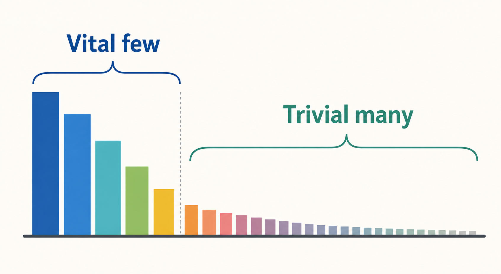
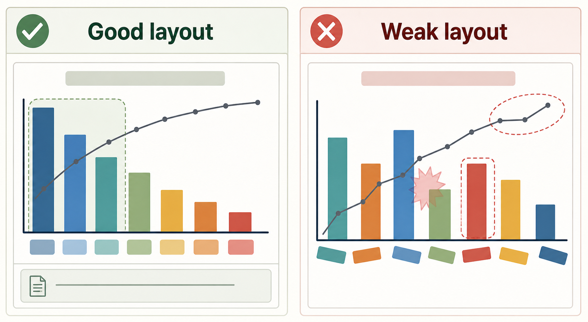

# Pareto Chart

Status: draft
Guide version: 0.1.0
Evidence risk: medium
Metadata: [method-kits/metadata/pareto-chart.yml](metadata/pareto-chart.yml)

## Summary

A Pareto Chart ranks counted categories from largest to smallest so a QCC team can see where problems are concentrated.
It helps the team focus analysis on the vital few categories before moving into cause analysis.
This guide teaches application, not only definition: method purpose, procedure, interpretation, common mistakes, review checklist, evidence expectations, and related methods all live in this one document.

## QCC stage fit

Use Pareto Chart during Understand Current Condition to summarize baseline defect, delay, complaint, or error categories.
Use it during Analyze Causes when category counts help decide where Fishbone Diagram or 5 Whys should start.

## What question this method answers

Which counted category or small group of categories contributes most to the current problem during the stated period and scope?

## When to use

Use Pareto Chart when categories are defined before counting, each event belongs to one category, and counts are collected over one consistent period and scope.
It works well after Check Sheet data collection or stratification of a larger problem.

## When not to use

Do not use Pareto Chart when categories overlap, the period changes by category, counts are estimates, or the team needs proof of root cause.
The chart prioritizes observed categories; it does not prove why those categories occurred.

## Required inputs

- Category names.
- Count for each category.
- One consistent date range.
- One consistent process, product, location, team, or other scope definition.
- Source data owner or source system.
- Category definition notes when names could be interpreted differently.

## Output

The output is a ranked category chart, usually column bars, with an optional cumulative percentage line capped at 100 percent.
The output should include a source note, date range, scope or filters, key finding, next action, and evidence note.

## Manual chart or worksheet recipe

Prepare a table with categories and counts, sort categories from largest to smallest, create column bars, optionally add a cumulative percentage line, and add the evidence note fields before final use.
Use the chart-creation sections below as the manual recipe.

## Chart purpose

A Pareto Chart answers where counted problems are concentrated.
It supports a QCC focus decision before deeper cause analysis.

## Required data structure

Use categories and counts.
Each row should contain one category and one non-negative count.
All categories must come from one consistent period and scope.
Keep the source data and category definitions with the chart.

## Data preparation

Clean blank category names.
Combine only categories that share the same definition.
Do not mix date ranges, products, lines, locations, or filters unless the scope intentionally includes them.
Calculate total count and percent of total.
If using a cumulative line, calculate cumulative count and cumulative percentage after sorting.

## Tool-selection guidance

Use spreadsheet tools, charting tools, presentation tools, or data-analysis tools when the source table and calculations remain reviewable.
Use statistical tools or a validated analysis path when the chart supports formal review, audit, high-risk evidence, or repeated generation.
The first slice uses tool classes only and does not require a named product.

## Chart construction steps

1. Create a two-column table with category and count.
2. Confirm all counts use one consistent period and scope.
3. Sort categories from largest to smallest by descending count.
   Review rule: sort categories from largest to smallest before creating the chart.
4. Create column bars using the sorted categories.
5. Optionally add a cumulative percentage line capped at 100 percent.
6. Add a clear title that names the problem, period, and scope.
7. Add readable category labels, count axis, and cumulative percentage axis if used.
8. Add a source note with source data, date range, scope or filters, and total count.
9. Annotate the selected vital few only when the annotation supports the next QCC action.

## Formatting standard

Use a clear title, correct chart type, readable labels, source note, correct scale, appropriate annotations, and defensible interpretation.
Column bars are the required base chart form.
The optional cumulative percentage line should never exceed 100 percent.

## Required annotations

- Source data.
- Date range.
- Scope or filters.
- Total sample or count.
- Sorting rule.
- Key finding.
- Next action.
- Evidence level and review status when used as final chart evidence.

## Interpretation rules

Safe interpretations identify the largest category, the top few categories, and the next analysis step.
Unsafe interpretations claim that rank proves root cause, permanent improvement, process stability, or countermeasure effectiveness.

## Common chart defects

- Missing source data.
- Mixed date ranges.
- Categories not sorted by descending count.
- Overlapping categories.
- Unreadable category labels.
- Cumulative percentage line not capped at 100 percent.
- Conclusion not tied to the visible data.

## Quality standards

The chart needs a clear title, correct chart type, readable labels, source note, correct scale, appropriate annotations, and defensible interpretation.
The conclusion should identify the largest contributor, the top few categories when useful, and the next QCC method or action.

## Interpretation guide

Read the largest bars first.
Use the cumulative line only to describe concentration, not to declare root cause.
If the top categories are close together, avoid over-focusing on one category without checking definitions and source quality.

Safe conclusions:

- Name the largest contributor.
- Name the vital few categories when they are visibly dominant.
- Describe the date range and scope with the conclusion.
- Connect the finding to the next QCC method or action.

Unsafe overclaims:

- Do not claim the tallest bar proves root cause.
- Do not claim a category is solved without before/after evidence.
- Do not compare two charts unless the periods, scopes, and category rules match.
- Do not use the cumulative line as a statistical rule.

## Example conclusion wording

- "The largest contributor is `[category]`, with `[count]` cases during `[date range]`."
- "The top three categories account for `[share]` of counted cases, so the team will investigate those categories first."
- "The next action is to study `[category]` with Fishbone Diagram or 5 Whys."
- "This chart prioritizes observed categories; it does not prove root cause."

## Common mistakes

- Mixing categories from different periods or scopes.
- Sorting alphabetically instead of by descending count.
- Using overlapping category definitions.
- Hiding the source data or date range.
- Treating the tallest bar as a proven cause.
- Adding fake precision or unsupported thresholds.

## Review checklist

Use this checklist before treating a Pareto chart as official QCC project material.

| Check | Pass | Fail | Notes |
|---|---|---|---|
| categories and counts are present |  |  |  |
| one consistent period and scope is used |  |  |  |
| categories are sorted by descending count |  |  |  |
| chart uses column bars |  |  |  |
| optional cumulative percentage line is capped at 100 percent |  |  |  |
| clear title names problem, period, and scope |  |  |  |
| source data, date range, and scope or filters are visible |  |  |  |
| labels and axes are readable |  |  |  |
| interpretation avoids root-cause overclaims |  |  |  |
| evidence note includes reviewer and review status |  |  |  |

Review result:

- Reviewer:
- Review date:
- Review status:
- Required fixes:

## Evidence note for final charts

For final data-dependent charts, complete this evidence note when the chart is being prepared for project use.
Preserve source data, date range, scope or filters, total sample or count, tool used, assumptions, exclusions, reviewer, review date, and review status.

Evidence note fields:

- Method: Pareto Chart
- QCC stage:
- Chart title:
- Source data:
- Data owner:
- Date range:
- Scope / filters:
- Total sample or count:
- Tool used:
- Calculation table location:
- Assumptions:
- Exclusions:
- Reviewer:
- Review date:
- Review status:

Evidence level fields:

- Evidence level:
- Reason for level:
- Review checklist location:
- Method guide version:

Evidence wording:

- For E1 draft use, state that the result is for team discussion.
- For E2 project presentation, include source data, period, scope, and reviewer checklist.
- For E3 formal review, preserve the calculation table and method guide version.
- For E4 audit or high-risk evidence, use a validated analysis path or independent verification.

## Image-assisted demonstration notes

Image prompts in this kit are support material for conceptual teaching only.
Generated images must not include exact project values, fake percentages, misleading axes, or claims of final project evidence.
Detailed method instructions stay in Markdown.

Reviewed teaching visuals:

The concept visual shows the vital few versus trivial many idea without exact values.

The layout comparison shows an orderly Pareto layout beside a weak unsorted layout.

Image prompt records:

- `../media/prompts/pareto-chart/pareto-chart-concept-v0.1.md`
- `../media/prompts/pareto-chart/pareto-chart-good-bad-layout-v0.1.md`

## Worked example

### Status

Synthetic sample data.
This example is not project evidence.

### Data

The sample data counts packing-label error categories for one fictional review period.
Total count: 100.

| Category | Count | Percent | Cumulative percent |
|---|---:|---:|---:|
| Wrong label applied | 42 | 42% | 42% |
| Missing label | 24 | 24% | 66% |
| Smudged print | 18 | 18% | 84% |
| Wrong carton | 10 | 10% | 94% |
| Other | 6 | 6% | 100% |

### Interpretation

Top category: Wrong label applied.
Top three categories: Wrong label applied, Missing label, and Smudged print account for 84% of counted sample cases.
The next action is to investigate Wrong label applied with Fishbone Diagram and 5 Whys.

### Evidence note

- Evidence level: E1
- Source data: synthetic sample data in this worked example
- Date range: fictional training period
- Scope / filters: fictional packing-label error sample
- Review status: training example only

## Teaching examples

### Good example review note

Status: Reviewed teaching example.
This is a conceptual only good example and not final project evidence.

The good example uses a clear title, visible categories and counts, descending count order, readable labels, and a source note.
It keeps the date range and scope visible.
It uses column bars and, if a cumulative line is shown, keeps the cumulative percentage capped at 100 percent.
It states a defensible interpretation and names the next QCC action without claiming root cause.

Review result:

- Example type: good example
- Review status: approved as teaching note
- Evidence status: conceptual only
- Not final project evidence: yes

### Bad example review note

Status: Reviewed teaching example.
This is a conceptual only bad example and not final project evidence.

The bad example has missing source data, mixed date ranges, unclear scope, and categories that are not sorted by descending count.
It may use a vague title, unreadable labels, or an uncapped cumulative line.
It overclaims by treating the tallest bar as root cause instead of a focus for investigation.

Review result:

- Example type: bad example
- Review status: approved as teaching note
- Evidence status: conceptual only
- Not final project evidence: yes

## Related methods

Upstream methods include Check Sheet and Stratification.
Downstream methods include Fishbone Diagram and 5 Whys.
