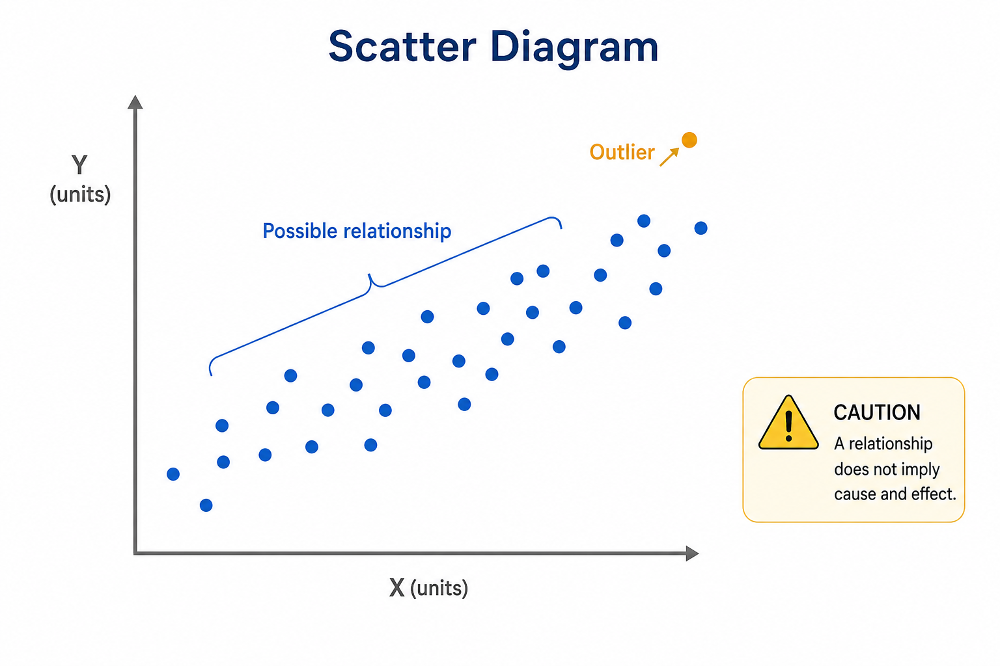
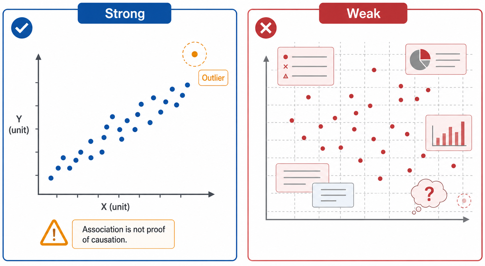

# Scatter Diagram

Status: draft
Guide version: 0.1.0
Method ID: scatter-diagram
Method name: Scatter Diagram
Method type: chart
QCC stages: analyze causes; plan verification; verify effects
Evidence risk: medium
Image policy: conceptual teaching images only
Automation policy: manual chart creation first; no chart-rendering automation in this slice

## Summary

A Scatter Diagram plots paired numeric observations for two variables.
It helps a QCC team explore whether the variables appear related enough to justify deeper investigation or designed verification.
This guide teaches relationship exploration and interpretation limits, not causal proof.

## QCC stage fit

Use Scatter Diagram during cause analysis when the team has a plausible relationship to check with paired measurements.
Use it during verification planning when the team needs to decide whether a suspected input and output should be tested more rigorously.
Use it during verification when paired before/after or process observations are available and interpretation limits are clear.

## What question this method answers

Do two measured variables appear related enough to justify deeper cause analysis, stratification, or controlled verification?

## When to use

Use Scatter Diagram when each observation has a numeric x value and a numeric y value from the same item, time, batch, person, location, or process condition.
It is useful when the team suspects one measured factor may move with another measured outcome.
It works best when variables, units, scope, and collection period are defined before interpretation.

## When not to use

Do not use Scatter Diagram when observations are not paired.
Do not use it for categories without numeric variables.
Do not use it when a time trend, shift, product mix, or hidden subgroup could explain the pattern but has not been considered.
Do not claim a scatter diagram proves root cause, causation, or countermeasure effectiveness by itself.

## Required inputs

- Paired numeric observations.
- X variable name and unit.
- Y variable name and unit.
- Pairing rule that explains why each x and y value belong together.
- Date range or observation period.
- Process, product, location, team, or other scope definition.
- Source data or owner.
- Exclusions and missing-pair rules.
- Outlier notes.

## Output

The output is a paired-variable plot with one point per observation pair.
The output should include a title, x-axis label and unit, y-axis label and unit, source note, sample size, scope, outlier notes, cautious interpretation, and evidence note.

## Manual chart or diagram recipe

Prepare a two-column table with paired numeric observations.
Plot the suspected input or explanatory variable on the horizontal axis and the response or outcome variable on the vertical axis when that framing is defensible.
Keep the source data and pairing rule reviewable.

## Chart purpose

A Scatter Diagram answers whether two variables appear related in the observed data.
It supports investigation planning and does not prove why the relationship exists.

## Required data structure

Use one row per paired observation.
Each row should contain an x value, a y value, and enough context to trace the pair.
Both variables must be numeric and measured under a consistent scope.

## Data preparation

Remove rows only when the exclusion rule is documented.
Do not silently drop missing pairs.
Check that x and y values are paired correctly.
Record units, date range, scope, and known stratification factors.
Identify outliers for review before interpretation.

## Tool-selection guidance

Use spreadsheet tools, charting tools, presentation tools, statistical tools, or data-analysis tools when the paired source table remains reviewable.
Use a validated analysis path or independent verification for formal-review, audit, or high-risk evidence.
Do not require a named product.

## Chart construction steps

1. Define the x variable and y variable.
2. Confirm each row has one paired numeric x value and y value.
3. Confirm the observation period and scope.
4. Plot one point per paired observation.
5. Label both axes with names and units.
6. Keep outliers visible and record notes for review.
7. Add source note, sample size, date range, scope, and pairing rule.
8. Describe the visible pattern cautiously.
9. State what additional cause analysis or designed verification is needed before claiming cause or effect.

## Formatting standard

Use a clear title, correct chart type, readable axis labels, visible units, source note, appropriate scale, visible outliers, and defensible interpretation.
Avoid visual decorations that make point patterns or outliers hard to read.

## Required annotations

- X variable name and unit.
- Y variable name and unit.
- Pairing rule.
- Source data.
- Date range or observation period.
- Scope or filters.
- Sample size.
- Outlier notes.
- Evidence level and review status when used as final project material.

## Interpretation limits

Safe interpretations describe whether the points appear to have no visible relationship, a possible positive relationship, a possible negative relationship, clusters, or outliers.
Unsafe interpretations claim causation, root cause, or verified improvement without deeper cause analysis or designed verification.
Consider hidden subgroups, time order, confounding factors, and outliers before deciding next steps.

## Common chart defects

- X and y values are not true pairs.
- Axis labels or units are missing.
- Sample size is hidden.
- Outliers are removed without rationale.
- A line or arrow implies causation without evidence.
- Hidden subgroups create a misleading overall pattern.
- Interpretation claims root cause from visual correlation.

## Quality standards

The scatter diagram should use paired numeric data, readable axes, visible units, visible outliers, source context, and cautious interpretation.
The chart should support the next investigation step rather than end the cause-analysis discussion.

## Interpretation guide

Start by checking the pairing rule, axes, units, sample size, and outliers.
Then look for an upward pattern, downward pattern, no visible pattern, clusters, or points that need source review.
Use the result to decide whether to stratify, collect more paired data, investigate an outlier, or design a stronger verification.

Safe conclusions:

- "The paired observations show a possible positive relationship between `[x]` and `[y]` during `[period]`."
- "No clear visual relationship is visible in this scope."
- "The outlier at `[context]` needs source review before interpretation."
- "This chart suggests a relationship to investigate; it does not prove root cause."

Unsafe overclaims:

- Do not claim correlation proves causation.
- Do not draw a causal arrow unless a separate verification supports it.
- Do not claim the suspected factor is root cause from the scatter plot alone.
- Do not use generated images as final scatter evidence.

## Example conclusion wording

- "The scatter diagram suggests `[x variable]` may be related to `[y variable]`, so the team will investigate that relationship with additional cause analysis."
- "The visible pattern is weak; the team should check stratification by `[factor]` before drawing conclusions."
- "This chart does not prove root cause or countermeasure effect."

## Common mistakes

- Plotting unpaired summary values.
- Swapping variables without explaining the meaning.
- Omitting units.
- Hiding outliers.
- Treating visual slope as proof of cause.
- Ignoring time order or hidden groups.
- Adding unsupported regression or correlation claims.

## Review checklist

Use this checklist before treating a scatter diagram as official QCC project material.

| Check | Pass | Fail | Notes |
|---|---|---|---|
| x and y observations are paired |  |  |  |
| both variables are numeric |  |  |  |
| axis labels and units are visible |  |  |  |
| date range and scope are recorded |  |  |  |
| sample size is visible |  |  |  |
| outliers are visible or exclusion is justified |  |  |  |
| source data and pairing rule are recorded |  |  |  |
| interpretation distinguishes relationship from causation |  |  |  |
| chart does not claim root-cause proof by itself |  |  |  |
| evidence note includes reviewer and review status |  |  |  |

Review result:

- Reviewer:
- Review date:
- Review status:
- Required fixes:

## Evidence note for final charts

For final data-dependent charts, complete this evidence note when the scatter diagram is being prepared for project use.

Evidence note fields:

- Method: Scatter Diagram
- QCC stage:
- Chart title:
- X variable and unit:
- Y variable and unit:
- Pairing rule:
- Source data:
- Data owner:
- Date range:
- Scope / filters:
- Sample size:
- Tool used:
- Calculation table location:
- Assumptions:
- Exclusions:
- Outlier notes:
- Reviewer:
- Review date:
- Review status:

## Image-assisted demonstration notes

Image-assisted material for this method is conceptual only.
Generated visuals must not include fake correlation coefficients, unsupported causal arrows, root-cause proof claims, private details, or final-evidence claims.
Generated visuals are not final evidence.
Detailed method instructions stay in Markdown.

Reviewed teaching visuals:

The paired-variable visual shows a possible relationship pattern, an outlier, and a caution that relationship does not prove cause.

The comparison visual shows why paired points, axis labels, units, visible outliers, and causation cautions matter.

Image prompt records:

- `../media/prompts/scatter-diagram/paired-variable-pattern.md`
- `../media/prompts/scatter-diagram/good-vs-weak-scatter.md`

## Related methods

- Check Sheet: collect paired observations or source facts.
- Flowchart / Process Map: identify where variables are measured in the process.
- Fishbone Diagram: identify possible factors before testing relationships.
- 5 Whys: investigate a specific outlier or suspected causal path.
- Histogram: understand the distribution of either numeric variable before or after relationship exploration.
